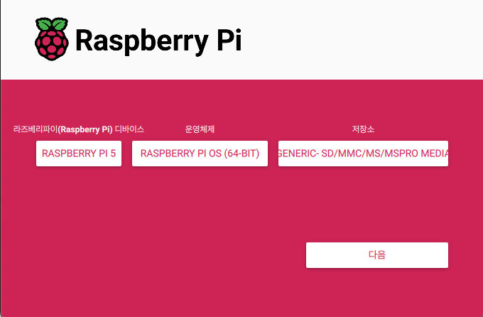
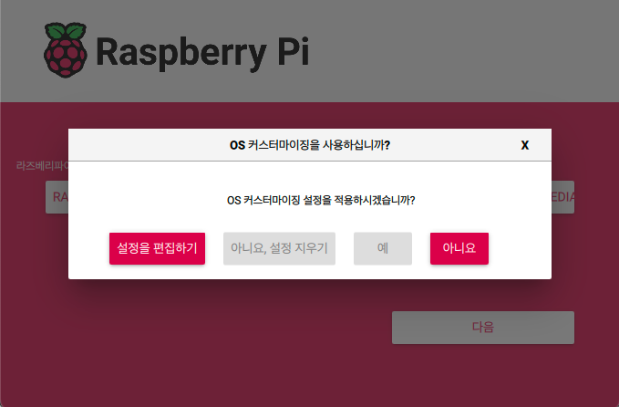
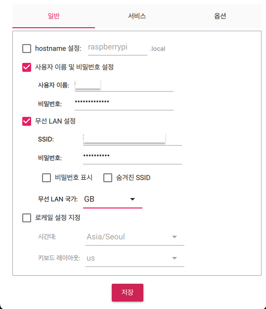
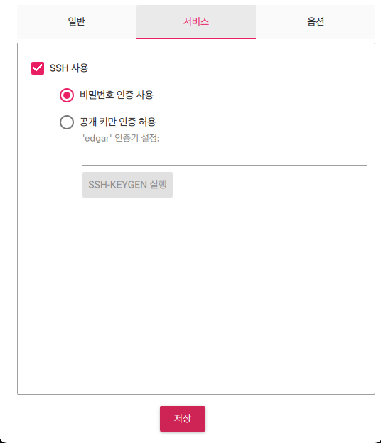
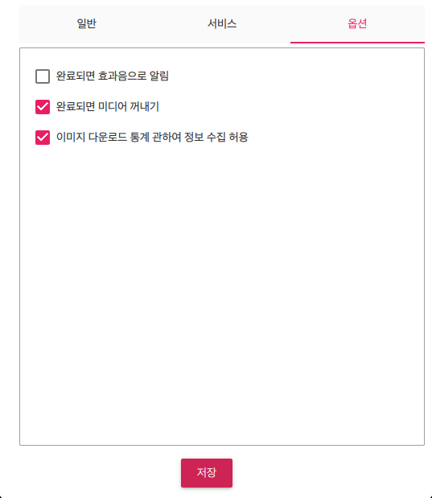
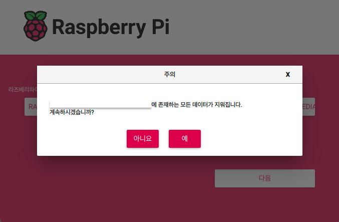

# 라즈베리파이에 웹 프로젝트 배포하기(1) 라즈베리파이 설치

## 배경

- Next.js를 사용하여 개인 블로그를 개발하던 중 배포환경을 빠르게 확인해보고자 Vercel을 통해 배포를 진행했습니다.
- 하지만 프로젝트 내부에서 이미지를 저장해야 하는 기능(예: 썸네일 이미지 등)을 구현하는 과정에서 Vercel의 서버리스 환경 특성상 이미지를 로컬에 저장할 수 없다는 제약이 존재했고, AWS S3와 같은 외부 저장소를 연동해야만 했습니다.
- AWS S3 연동은 회사 업무를 진행하면서 몇 번 경험을 했었고, 무엇보다 단순히 정적 파일 하나 저장하는 일인데도 생각보다 많은 설정이 필요하고, 서비스 구조도 복잡해진다는 생각이 들었습니다.
- 이 과정에서 "로컬에 저장한 이미지를 사용하고, 직접 제어할 수 있는 서버가 있으면 좋겠다"는 생각이 들었고, 예전부터 관심은 있었지만 막상 시도해보지 못했던 라즈베리파이를 활용한 배포 환경을 구축을 떠올리게 되었습니다.
- 이번 기회에 Docker, Nginx, 도메인 연결, HTTPS 설정까지 직접 해보면서 과정을 정리해보고, 배우고 느꼈던 점들을 정리해보고자 합니다.

## 순서

1. 라즈베리파이 설치
2. 라즈베리파이에 Docker로 Next.js 블로그 배포하기
3. 도메인 연결과 HTTPS 인증으로 서비스 외부 공개하기

## 라즈베리파이 설치(for MAC)

### OS 설치

- 필요 장비 준비(라즈베리파이, 케이스, 어댑터, micro SD 카드 등)

- 먼저 라즈베리파이 OS 홈페이지에 접속해서 Raspberry Pi Imager를 설치

  https://www.raspberrypi.com/software/ 접속 > Download for Mac OS

- Raspberry Pi Imager를 통해 micro SD 카드에 OS 이미지 설치

  

  - Raspberry Pi Imager : 라즈베리파이 운영체제(OS) 이미지를 SD 카드에 굽는 도구

  - Device, OS, Storage를 알맞게 선택 후, OS 커스터마이징 진행

  

  - OS 커스터마이징(SD 카드를 라즈베리파이에 연결 시 WiFi와 연결하기 위함)

    1. 사용자 이름 및 비밀번호 : 추후 라즈베리파이 직접 로그인할 때 필요(공개키 인증 방식으로 접속시엔 불필요)

    2. 무선 LAN 설정 : 라즈베리파이가 기본으로 연결할 WiFi 주소와 비밀번호(5Ghz 이슈로 2.4Ghz로 설정)

       라즈베리파이에 원격으로 접속하기 위해서는 동일한 네트워크에 호스트 컴퓨터(내 맥북)와 라즈베리파이가 접속할 수 있도록 환경을 구성해야 한다. 즉, SSID가 A_WIFI_2.4인 네트워크에 호스트 컴퓨터가 접속되어있다면 무선 LAN 설정도 동일한 네트워크의 SSID와 비밀번호로 설정해야 호스트 컴퓨터에서 라즈베리파이로 원격 접속할 수 있다.

  

  3. SSH 사용 공개 키만 인증 허용. 공개키 입력 후 저장

  

  

- 저장 후 SD 카드에 OS 이미지 설치 진행

  

- SD 카드를 빼고 라즈베리파이에 삽입 및 라즈베리파이 전원켜기

### SSH 접속

- `ssh username@raspberrypi_name` 과 같은 형식으로 라즈베리파이에 원격 접속하기

  간혹, 호스트명으로 접속에 실패할 경우 정확한 IP 주소를 입력해야 정상적으로 작동된다. 라즈베리파이 IP 주소를 확인하려면 호스트 컴퓨터에서 IP 스캔 프로그램을 사용해 확인이 가능하다.(나의 경우 앱스토어에서 "lanscan" 이란 프로그램 설치하여 확인) 이 경우엔 `ssh username@192.168.0.1 <엔터>`와 같은 방식으로 접속하면된다.

- 맥 OS에서 터미널 프로그램으로 SSH 접속

  맥OS에서 터미널 프로그램을 열어 다음과 같은 형식으로 명령어를 입력한다. 먼저 ssh라는 명령어를 입력하고, 사용자명과 라즈베리파이 이름을 차례로 입력한다. 사용자명과 라즈베리파이 이름은 @ 문자로 구분한다. 여기에서 사용자명과 라즈베리파이 이름은 라즈베리파이 OS를 설치할 때 커스터마이징 OS에서 입력한 사용자명과 라즈베리파이 이름을 사용해야한다. (만약 커스터마이징 OS를 적용하지 않고 기본 설정으로 사용한 경우 사용자명은 pi이고, 라즈베리파이의 이름은 raspberrypi.local이다. 또한 접속시 필요한 비밀번호는 raspberry이다.) 라즈베리파이 이름을 다른 용어로 호스트명이라고 부른다. 호스트는 네트워크에 연결된 장치로서, 데이터를 전송하거나 수신할 수 있는 컴퓨터나 기타 장치를 의미한다.

  나의 경우 `ssh edgar@raspberrypi.local` 이 된다.

- 시큐어 셸(SSH)

  SSH(Secure Shell)는 네트워크를 통해 안전하게 컴퓨터 시스템에 접근할 수 있도록 해주는 암호화 프로토콜이자 프로그램 이름. 라즈베리파이 OS를 설치할 때 커스터마이징 OS 설정에서 SSH를 활성화해야 원격으로 접속할 수 있게 문을 만들어 둔 것.

  - 비밀번호 인증

    사용자명과 비밀번호를 이용하여 원격지에 접속하는 방식

  - 공개키 인증

    공개키와 개인키를 사용하여 인증하는 방식

    공개키는 배포할 수 있고, 개인키는 보호해야 한다.

    SSH키를 이용하면 GitLab 원격 서버에 인증할 때마다 사용자 이름과 비밀번호를 입력할 필요가 없다.

    SSH 공개키를 이용하면 편의성과 보안성 모두를 높일 수 있다.

- SSH 인증 과정(전자 서명 기반 인증)

  1. 서버(라즈베리파이)에는 내 공개키(예 : `id_rsa.pub`)가 authorized_keys에 저장되어 있음

  2. `ssh username@hostname`과 같은 방식으로 SSH에 접속을 시도

  3. 서버가 "너 공개키 뭐 있음?"하고 요청함 => 이러면 클라이언트(나 같은 경우 맥북)는 개인키에 대응하는 공개키를 제안함

  4. 서버는 그 공개키가 authorized_keys에 있으면 서버는 클라이언트에게 암호 퍼즐 같은 challenge(랜덤 데이터 + 공개키 기반 암호화)를 보냄

  5. 클라이언트는 개인키로만 풀 수 있는 방식으로 해독해서 성공하면 서버에서 인정해줌.

     정확히는 challenge를 개인키로 "서명(sign)"하는 것. 서명하여 "해당 데이터를 확인했고 내가 맞다는 증거야"하고 전자 서명을 남기는 것.

     서버에서 인정해준다는 것은 공개키로 서명을 검증하는 것. 공개키로 서명을 검증할 수 있다는 건 서명한 사람이 개인키를 갖고 있음이 확실하다는 것.

- SSH 명령어

  `ssh-keygen` : SSH키 쌍(개인키/공개키) 생성

  `ssh-keygen -t rsa -f ~/.ssh/id_rsa` : rsa 방식으로 해당경로에 SSH 키 쌍 생성

  `ssh-keygen -lf ~/.ssh/id_rsa.pub` : 공개키의 지문 확인, `ssh-keygen -y -f ~/.ssh/id_ed25519 | ssh-keygen -lf -` : 개인키에서 공개키 추출하여 앞의 공개키 지문과 동일한지 비교(SSH 키 유효성/매칭 확인용)

  `ssh username@raspberrypi.local` : 라즈베리파이의 `.local` 호스트 이름으로 SSH 접속(mDNS가 작동할 때만 가능)

  `ssh username@192.168.xx.xx` : 라즈베리파이의 실제 IP 주소로 SSH 접속(`.local`이 안 될 때 항상 이 방식이 가장 확실함)

  `ssh -i ~/.ssh/id_rsa username@192.168.xx.xx`. : 접속 시 특정 개인키를 명시해서 접속

  `ssh -v username@192.168.xx.xx` : SSH 접속 디버깅용

  `exit` or `Control + D` : 연결 끊기

- `.local`이 IP 주소보다 불안정한 이유

  `.local` 도메인은 로컬 네트워크 안에서 장비를 이름으로 찾기 위한 방식. 이는 mDNS(multicast DNS) 또는 Bonjour라는 기술을 통해 작동된다.

  `ssh username@raspberrypi.local`은 실제로 네트워크에서 `raspberrypi.local`이름을 갖는 장비의 IP 주소를 찾는 과정이 먼저 필요하다.

  IP 주소 방식과의 차이점

  | **방식**    | .local **(mDNS)**                                    | **IP 주소 직접 입력**           |
  | ----------- | ---------------------------------------------------- | ------------------------------- |
  | 사용성      | 기억하기 쉬움 (사람 친화적)                          | 외우기 어려움                   |
  | 동작        | **이름을 IP로 변환**해야 함 (mDNS 브로드캐스트 필요) | 바로 접속                       |
  | 불안정 요소 | 네트워크/공유기/mDNS 환경 영향 받음                  | 없음 (IP만 알면 100% 접속 가능) |
