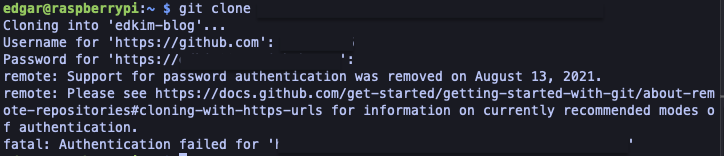

# 라즈베리파이에 웹 프로젝트 배포하기(2) 

## 라즈베리파이에 Docker로 Next.js 블로그 배포하기

- SSH를 통해 라즈베리파이에 원격접속 해준다.

  ```bash
  ssh edgar@raspberrypi.local
  or
  ssh edgar@라즈베리파이에 할당된 내부IP
  ```

- Docker & Docker Compose 설치

  ```bash
  sudo apt update # 패키지 목록 최신화
  sudo apt install -y docker.io # Docker 설치
  sudo apt install -y docker-compose # Docker Compose 설치
  sudo reboot # 재부팅(선택)
  ```

  설치 후 버전 확인

  ```bash
  docker -v # Docker version 20.10.24+dfsg1, build 297e128
  docker-compose -v # docker-compose version 1.29.2, build unknown
  ```

- 블로그 프로젝트 Docker로 띄우기

  gitHub에서 클론하는 경우

  ```bash
  git clone https://github.com/your-username/your-repo-name.git # GitHub에서 프로젝트 클론
  cd your-repo-name # 프로젝트 디렉토리로 이동
  ```

  다른 방법으로 로컬에서 라즈베리파이로 프로젝트를 복사하는 방법이 있음

- `.env` 파일 생성(프로젝트 루트에서)

  ```bash
  nano .env # 환경변수 파일 생성
  ```

  프로젝트에서 사용되는 환경변수들을 작성해준다.

  ```bash
  DATABASE_URL=postgresql://bloguser:yourpassword@db:5432/blogdb   # PostgreSQL 접속 정보 (docker-compose의 db 서비스 기준)
  NEXT_PUBLIC_BASE_URL=http://your.rpi.ip.address:3000             # 라즈베리파이의 IP 주소
  ```

  > 저장 : Ctrl + O, 종료 : Ctrl + X

- `docker-compose.yml` 생성

  여러 개의 Docker 컨테이너를 한 번에 쉽게 정의하고 실행하기 위해서 `docker-compose.yml` 파일을 생성해준다.

  ```yml
  version: "3.8"
  services:
    blog:
      build: .
      container_name: blog_container
      ports:
        - "3000:3000"
      env_file:
        - .env
      depends_on:
        - db
      restart: always
    db:
      image: postgres:latest
      container_name: db_container
      restart: always
      ports:
        - "5432:5432"
      env_file:
        - .env
      volumes:
        - postgres_data:/var/lib/postgresql/data
  volumes:
    postgres_data:
  ```

- 현재 돌아가는 컨테이너 목록 확인

  ```bash
  docker ps -a
  ```

- Dockerfile 생성

  Docker가 앱을 컨테이너로 만들려면 빌드 방법이 필요한데 이를 Dockerfile에 정의한다.

  Node 설치, 코드 복사, 빌드, 실행 이러한 흐름만 있으면 됨

  ```dockerfile
  # Node.js LTS 기반 이미지 사용 (ARM에서도 잘 돌아감)
  FROM node:18
  # 작업 디렉토리 설정
  WORKDIR /app
  # 코드 복사
  COPY . .
  # 의존성 설치
  RUN npm install
  
  # Next.js 앱 빌드
  RUN npm run build
  
  # 3000 포트 노출
  EXPOSE 3000
  
  # 앱 실행 (빌드된 Next 앱 실행)
  CMD ["npm", "start"]
  ```

  준비됐으면 실행(정의된 서비스를 백그라운드로 빌드하고 실행)

  ```bash
  docker-compose up -d
  ```

- Prisma 마이그레이션(초기 1회)

  ```bash
  docker-compose exec blog npx prisma migrate deploy
  ```

  blog는 Next.js 앱 서비스 이름 기준. 서비스명이 다르면 docker-compose ps로 컨테이너 이름 확인하고 맞추면 됨

- 정상동작 확인

  ```bash
  docker ps
  docker ps -a
  ```

## TIL

- docker-compose 사용이유

  현재 블로그 프로젝트는 Next.js, PostgresSQL DB 이렇게 두 개의 컨테이너가 필요한데 docker-compose 없이 하려면 아래와 같은 방식으로 컨테이너 실행 및 Dockerfile 빌드를 따로 해줘야함

  ```bash
  # PostgreSQL 컨테이너 따로 실행
  docker run -d \
    --name my-db \
    -e POSTGRES_USER=bloguser \
    -e POSTGRES_PASSWORD=yourpassword \
    -e POSTGRES_DB=blogdb \
    postgres:15
  
  # Next.js 앱 Dockerfile 빌드
  docker build -t my-blog-app .
  
  # Next.js 컨테이너 실행
  docker run -d \
    --name my-app \
    --env-file .env \
    -p 3000:3000 \
    --link my-db \
    my-blog-app
  ```

  docker-compose를 사용하면, `docker-compose.yml` 파일 하나로 

  - 어떤 컨테이너를 몇 개 띄울지
  - 환경변수, 포트, 볼륨, 의존성
  - 실행 순서, 이름까지

  다 한 파일에 정리할 수 있다.

- 로그인 없이 도커 명령어 사용이 가능한 이유

  Docker Hub에 로그인하지 않았어도 public 이미지만 사용할 경우에는 로그인 없이도 실행 가능하다.

  그 이유는

  - Docker는 설치하면 **로컬에 Docker 엔진(데몬)**이 함께 설치됨
  - docker-compose는 그 엔진에 명령을 보내서 컨테이너를 실행하는 것
  - 로그인은 **Docker Hub(=이미지 저장소)**에서 **private 이미지**를 가져올 때만 필요함

- Docker - postgreSQL DB - prisma

  - `docker run ...` 혹은 `docker-compose up -d` 

    Docker에 비어있는 PostgreSQL 컨테이너 실행. 즉, DB 서버는 켜졌지만 안에 테이블이나 데이터는 아직 없는 상태


    - 스키마 정의

      prisma/schema.prisma 수정


    - `npx prisma migrate dev`

      마이그레이션으로 DB 스키마 적용

      :bulb: 마이그레이션 : Prisma 스키마에서 정의한 DB 구조를 실제 데이터베이스에 반영하기 위한 변화 기록을 만드는 것을 의미한다. 즉, DB에 어떤 변화(테이블 추가, 컬럼 수정 등)를 할지 Prisma가 기억하고 실행할 수 있도록 이력을 만드는 작업


    - `npx prisma db seed` 

      `prisma/migrations`에 정의된 내용을 DB에 반영하고, 자동으로 `prisma db seed`도 실행해준다.


    - `npx prisma migrate reset` 
      - 기존 DB를 완전히 리셋
        - 마이그레이션 다시 적용
        - seed도 자동 실행

## Trouble Shooting :dart:

### Git Clone Error

- 라즈베리파이에 프로젝트를 gitHub에서 클론할 때 아래와 같은 에러 발생

  

- 원인은 2021년부터 HTTP 방식에서 "아이디 + 비밀번호 로그인"을 막음

  따라서 Personal Access Token(PAT) 방식이나 SSH 방식 중 하나를 써야 함.

- GitHub에서 Personal Access Token(PAT)을 만든 후 해당 토큰 정보는 안전하게 보관

  https://github.com/settings/personal-access-tokens

- 라즈베리파이에 Git credential helper 설정

  라즈베리파이에 자격증명 캐시 기능 설정(메모리 기반 캐시)

  ```bash
  git config --global credential.helper cache
  git config --global credential.helper 'cache --timeout=3600'   # 1시간 저장
  ```

  | **방식**                      | **설명**                 | **보안** | **추천도**  |
  | ----------------------------- | ------------------------ | -------- | ----------- |
  | credential.helper store       | 자격증명을 평문으로 저장 | 🔸 낮음   | 간편하긴 함 |
  | credential.helper cache       | 메모리에 일정 시간 저장  | 🔹 중간   | 🔥 추천      |
  | credential.helper osxkeychain | macOS 전용               | 🔐 높음   | 맥북 전용   |

  평문 텍스트로 저장하는 방식(단순하지만 위험할 수 있어서 위의 캐시방식 권장)

  ```bash
  git config --global credential.helper store
  ```

- 한 번만 사용자 명 + PAT 입력

- 이후 자동으로 저장된 자격증명 사용됨

### Docker compose up

- `.env`, `Dockerfile`, `docker-compose.yml`생성 후 백그라운드 실행을 위해 `docker-compose up -d`를 했지만 아래와 같은 에러 발생

- PermissionError: [Errno 13] Permission denied
  docker.errors.DockerException: Error while fetching server API version

- 원인은 현재 사용자(edgar)가 docker 명령어를 실행할 권한이 없어서 생긴 에러. 즉, Docker 데몬에 접근 권한이 없는 상태.

- 방법1. sudo 붙이기(간단)

  ```bash
  sudo docker-compose up -d
  ```

  이러면 root 권한으로 Docker에 접근해서 문제 없이 실행됨.

- 방법2. docker 그룹에 현재 사용자 추가하기(근본적인 해결방법)

  ```bash
  sudo usermod -aG docker $USER
  ```

  위 명령은현재 사용자(edgar)를 docker 그룹에 추가해서 매번 sudo 없이도 Docker를 쓸 수 있게 해줘.

  **추가 후에는 꼭 로그아웃 후 다시 로그인하거나 셸 재시작이 필요함**

  ```bash
  newgrp docker # 또는 그냥 재로그인
  ```

### 