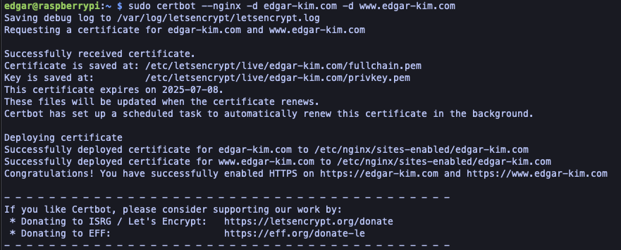
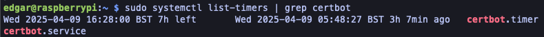

# 라즈베리파이에 웹 프로젝트 배포하기(3)

## 도메인 연결과 HTTPS 인증으로 서비스 외부 공개하기

### 1. 라즈베리파이 공인 IP 확인 & 포트 포워딩 설정

- 먼저, 라즈베리파이가 인터넷을 통해 접근 가능한 IP 주소를 가져야한다. 현재 집에서 사용하는 대부분의 인터넷은 공유기 뒤에 있는 사설 IP만 갖고 있으니 이를 위해 포트 포워딩이 필요하다.

  :bulb: 포트포워딩? 포트포워딩 개념은 집에서 사용하는 공유기는 하나의 공인 IP로 여러 기기를 연결시키기 때문에, 외부에서 들어오는 요청이 어느 기기로 가야하는지 알 수 없다. 그래서 "이 포트로 요청이 들어오면 이 내부 기기로 보내줘!"하고 공유기한테 미리 알려주는 설정이 포트포워딩이다.

  예시 : 라즈베리파이 내부 IP가 `192.168.0.101` 이고, 블로그가 3000번 포트에서 실행중일 때 공유기 포트 포워딩에 아래처럼 설정하면 **외부 요청을 내부 장비로 전달하는 터널 같은 역할**을 해준다

  ```
  외부에서 http://공인IP:80 으로 요청 →
  공유기가 192.168.0.101:3000으로 전달 →
  라즈베리파이의 블로그 서비스 응답
  ```

- 라즈베리파이에서 브라우저나 터미널로 `https://ifconfig.me` 접속하여 라즈베리파이의 공인 IP 주소를 확인한다.

  ```bash
  curl https://ifconfig.me
  # 211.49.195.42
  ```

  :bulb: 공인 IP 주소는 공유기 바깥 즉, 인터넷에 연결된 모든 사람(외부)에게 보이는 IP 주소를 말하는데 공유기 하나가 이걸 가지고 있다. 위에서 말한 사설 IP는 공유기에 연결된 각 기기(맥북, 라즈베리파이 등)가 내부에서만 사용하는 IP 주소를 말한다. 예: `192.168.x.x`

  예를들어 공인 IP가 `123.45.67.89`라면 외부에서 블로그에 접속하기 위해 `123.45.67.89`로 요청을 보내야한다.

  하지만 우리가 사용중인 라즈베리파이가 직접 공인 IP를 가진 게 아니기 때문에, 공유기가 그 요청을 라즈베리파이에게 **포트 포워딩**으로 전달해줘야 한다.

- 공유기 관리자 페이지에 접속하여 포트 포워딩 설정

  페이지 접속 후 보통의 경로 : **고급 설정** → **NAT/라우터 설정** → **포트 포워딩**

  설정정보

  | **항목**        | **입력값**    | **설명**                |
  | --------------- | ------------- | ----------------------- |
  | 포트포워드 활성 | ✅ 체크        | 반드시 체크해야 동작해  |
  | 외부 포트 범위  | 3000 - 3000   | 외부에서 열 포트        |
  | 내부 IP 주소    | 192.168.0.101 | 라즈베리파이의 IP       |
  | 내부 포트       | 3000          | 블로그가 동작하는 포트  |
  | 프로토콜        | TCP 또는 BOTH | TCP만 해도 충분         |
  | 설명            | nextjs-blog   | 네가 알아보기 위한 이름 |

### 2. 가비아 도메인에 A레코드 설정

✅ A레코드로 **도메인을 공인 IP에 연결**

- 가비아 A레코드 설정

  | **항목** | **설정값**                |
  | -------- | ------------------------- |
  | 타입     | A                         |
  | 호스트   | @                         |
  | 값/위치  | 너의 공인 IP 주소         |
  | TTL      | 그대로 두면 됨 (예: 1800) |

- 호스트가 @인 경우

  edgar-kim.com 루트 도메인을 의미함. 즉, http://edgar-kim.com 으로 접속 가능하게 됨

- TTL(Time To Live)

  TTL은 DNS 레코드가 얼마나 오래 "캐시(저장)"되어야 하는지를 나타내는 시간 값. 즉, 사용자의 컴퓨터나 DNS 서버가 이 정보를 "몇 초 동안 기억할지"를 정하는 값

  예를들어 TTL을 1800으로 설정 후 어떤 사용자가 한 번 접속하면 그 사람의 컴퓨터나 중간 DNS 서버는 이 IP 정보를 1800초(=30분) 동안 기억한다. 이 30분 동안은 DNS 서버에 다시 물어보지 않고 캐시된 IP로 접속한다.

- TTL 설정 팁은 처음 도메인 연결하거나 테스트 중일 경우엔 짧게(예 : 300), 설정이 안정화된 운영 환경에선 길게(예: 3600, 86400 등)

### 3. Next.js 앱을 Nginx로 reverse proxy 세팅(선택)

**전체 흐름 요약**

1. Nginx 설치 및 설정 (80 → 3000 리버스 프록시)
2. Certbot 설치 및 HTTPS 인증서 발급
3. 자동 HTTPS 적용 + 리디렉션(optional)

- Nginx 설치

  ```bash
  sudo apt update
  sudo apt install nginx
  ```

  설치 후 실행 확인:

  ```bash
  sudo systemctl status nginx
  ```

- 리버스 프록시 설정(포트 80 => Docker의 3000 포트)

  ```bash
  sudo nano /etc/nginx/sites-available/edgar-kim
  ```

  아래처럼 입력

  ```bash
  server {
      listen 80;
      server_name edgar-kim.com www.edgar-kim.com;
  
      location / {
          proxy_pass http://localhost:3000;
          proxy_http_version 1.1;
          proxy_set_header Upgrade $http_upgrade;
          proxy_set_header Connection 'upgrade';
          proxy_set_header Host $host;
          proxy_cache_bypass $http_upgrade;
      }
  }
  ```

  설정 활성화 :

  ```bash
  sudo ln -s /etc/nginx/sites-available/edgar-kim /etc/nginx/sites-enabled/
  sudo nginx -t # 설정 검사
  sudo systemctl reload nginx
  ```

  - `sudo ln -s /etc/nginx/sites-available/edgar-kim /etc/nginx/sites-enabled/` 

    > sites-available/edgar-kim 이라는 설정 파일을 sites-enabled/ 안에 연결해서 **Nginx가 실제로 이 설정을 사용하게 만드는 것**

    `ln` : **링크(Link) 생성** 명령어 (파일 시스템 상의 “바로가기”)

    `-s` : **심볼릭 링크(symbolic link)**, 윈도우로 치면 “바로가기” 같은 개념

  - `sudo nginx -t`

    **Nginx 설정 파일의 문법을 검사**하는 명령어

    설정을 바꾸고 나서 **적용하기 전에 문법 체크**할 때 꼭 써야함. 실서버에선 안 쓰고 reload 하면 서버 죽는 경우도 있음 😅

  - `sudo systemctl reload nginx`

    `systemctl` : 시스템 서비스(데몬)를 관리하는 명령어

    `reload nginx` : 설정을 다시 읽어서 **재시작 없이 적용**(restart는 서버를 껐다 켜는 거고, reload는 **중단 없이 설정만 다시 적용**하는 것이라서 웹 요청이 끊기지 않는다.)

- Certbot 설치 및 HTTPS 인증서 발급

  ```bash
  sudo apt install certbot python3-certbot-nginx
  ```

  그 다음 실행 :

  ```bash
  sudo certbot --nginx -d edgar-kim.com -d www.edgar-kim.com
  ```

  → 중간에 이메일 입력, 약관 동의 등 물어볼 수 있음

  → 자동으로 SSL 인증서 설치 + HTTPS 리디렉션 설정됨

  

  HTTPS 인증서 발급 완료 + Nginx에 자동 적용 성공

- 테스트

  - https://edgar-kim.com 접속

- 인증서 자동 갱신 설정 확인

  ```bash
  sudo systemctl list-timers | grep certbot
  ```

  → 기본적으로 매일 갱신 여부 체크함

  

  다음 실행 시각, 최근에 실행된 시각 등과 같은 정보 확인 가능

## TIL

- 공유기 포트포워딩은 외부에서 라즈베리파이로 트래픽을 전달만 해주는 역할을하는데, 여기서 "전달만 한다"는 뜻이 무엇일까?

  공유기 입장에선 외부에서 공유IP로 들어오는 요청을 공유기가 내부망에 있는 내부IP(예: 라즈베리파이)로 전달만 해준다.

  여기서 전달만 한다는 것은

  - 공유기는 **데이터를 해석하거나 처리하지 않음**
  - 단지 “이 요청은 누구한테 보내줘야 하지?“만 판단해서,**너의 라즈베리파이로 패킷을 넘겨줌**
  - 그 이후에는 **라즈베리파이에서 무슨 프로그램이 이걸 처리하느냐에 따라 다름**
  - 여기서 요청을 처리하는 건 Nginx와 같이 "요청을 받아서 처리하거나 넘기는 역할"을 하는 프로그램이 한다.

## Trouble Shooting :dart:

### Unaccessable via brower

- 맥북에서 라즈베리파이에서 실행중인 서버에 접속하려고 시도했으나 간헐적으로 접속되고 접속이 안됨.

- 현재까지 시도

  | 항목                                        | 상태                                    |
  | ------------------------------------------- | --------------------------------------- |
  | 라즈베리파이에서 `curl localhost:3000`      | HTML 응답 정상                          |
  | 라즈베리파이에서 컨테이너 상태(`docker ps`) | blog_web 컨테이너 정상 실행             |
  | 맥북에서 라즈베리파이 IP 3000포트로 접속    | "사이트에 연결할 수 없음"에러           |
  | 같은 공유기 사용                            | 맥북과 라즈베리파이 모두 같은 SSID 연결 |

- 예상할 수 있는 문제는 네트워크 경로 또는 라우팅/방화벽 문제


### Chrome HSTS

- 공유기 관리자 사이트에 접속하고자 했는데 크롬에서만 접속이 불가함

- Safari, 스마트폰에서는 잘 됨 → 네트워크 이상 없음

- Chrome이 HSTS 때문에 https://192.168.35.1로 강제 시도 → 공유기 응답 X → “응답 없음”처럼 보임

- 원인 : 브라우저 캐시, HTTPS 리디렉션, 혹은 세션 정보 때문

  - **HTTPS 자동 리디렉션**

    이전에 IP주소로 잘못 접속 시도했던 기록이 남아서 계속 HTTPS로 가려 함

  - **HSTS 기록**

    크롬은 HSTS(강제 HTTPS 접속 기록)를 캐시에 저장함. 한 번이라도 HTTPS 실패하면 그 주소로는 계속 실패

  - **쿠키/세션 꼬임**

    공유기 로그인 세션이 꼬이거나 남아 있는 쿠키로 접근이 막힐 수 있음

- 해결법 : 크롬에서 해당 주소의 HTTPS 기록 지우기(HSTS 초기화)

  - chrome://net-internals/#hsts 에 접속
    1. Delete domain security policies 아래에IP주소 입력
    2. “Delete” 버튼 클릭
    3. 크롬 완전히 껐다가 다시 실행
    4. 다시 IP주소로 접속 시도

### Port forwarding

- 포트 포워딩 설정을 했으나 외부 접속이 되지 않음

  라즈베리파이에서 블로그가 제대로 실행중인 상태고, 포트 포워딩 설정도 알맞게 했지만 외부에서 접속이 불가능함

- 공유기가 외부에서의 포트 접근을 막고있을 가능성이 존재

  [포트 오픈 테스트 사이트](https://www.yougetsignal.com/tools/open-ports/)에서 "Port to Check"에 설정한 포트번호인 3000, "Remote Address"에 공인 IP주소 입력 후 확인해보니 Port is Closed(공유기에서 막고 있거나 ISP에서 차단 중)가 확인됨

  => 외부에서 라즈베리파이로의 연결이 차단되고 있다는 뜻. 이 경우 SKB에서 외부 포트 자체를 막고 있을 가능성이 높음

- SK 브로드밴드 고객센터(106)에 전화해서

  > *“공인 IP 환경에서 외부 접속 테스트를 하려는데, 공유기의 외부 포트 3000 접근이 막혀 있는 것 같습니다. 포트포워딩이 제대로 되도록 외부 접속 차단을 해제해 주세요.”*

  라고 요청하면 됨.

- 하지만 위에는 그냥 삽질이었고, 관리자 페이지에서 **포트포워딩 "활성화 체크"가 안되어 있어서** 지금까지 안 된 거였음...

### Reverse Proxy

- 가비아에 공유 IP 연결을 한 후에 접속을 해보려고 했지만 접속실패. 다만 ping은 성공함

- 이 경우 대부분 Nginx 프록시로 80포트 연결 필요

- 잘 이해가 안가는 건 공유기 관리자 페이지에서 외부포트는 80 내부포트는 3000으로 설정을 했는데 그렇다면 80포트로 요청이 들어오면 localhost:3000으로 가야하는거 아닌가하는 의문임

- 핵심포인트 :star2:

  공유기 포트포워딩은 "외부 → 라즈베리파이"로 트래픽을 전달해주는 역할만 한다. 하지만 라즈베리파이 내부에서 그 요청을 실제로 받아줄 프로그램(예: Nginx 등)이 없으면 응답은 나오지 않는다.

- 예시 설정 상황

  - 공유기 포트포워딩 : 외부 80 → 내부 192.168.0.101:3000

  - 도커 컨테이너 안에서 Next.js 서버는 3000번 포트에서 실행 중

  - 라즈베리파이의 3000번 포트로 들어오는 요청은 Docker가 잘 받음

  - 하지만 80 포트에는 아무것도 없음

  - 중요한 구분

    | **구간**                  | **역할**          | **설명**                               |
    | ------------------------- | ----------------- | -------------------------------------- |
    | **공유기 → 라즈베리파이** | 포트포워딩        | 외부 포트(80) → 내부 포트(3000)로 전달 |
    | **라즈베리파이 내부**     | 웹 서버(Nginx 등) | 80포트 요청을 실제로 처리해야 함       |

- 여기서 왜 동작을 하지 않는가?

  - 공유기는 분명히 **“80번 포트 요청이 오면 → 라즈베리파이의 3000번 포트로 보내줄게!”** 라고 약속했음.

  - 그런데 라즈베리 파이에 도착한 요청은

    - 목적지 : 3000포트
    - 컨테이너 안의 Next.js 서버는 잘 듣고 있음
    - 하지만 브라우저는 80포트 요청을 함

  - 문제는 

  - 브라우저는 edgar-kim.com:80으로 요청했는데,

    응답을 받는 쪽에서는 **“80 포트에서 받은 요청이 아니니까”**

    → **Host 헤더, 라우팅, 리디렉션 등에서 오작동이 생길 수 있음**

  - 그리고 더 중요한 것은 **라우터가 “포트포워딩”만 해줄 뿐, 라즈베리파이에서 그걸 처리할 서버는 직접 띄워야 한다.**

- 즉, **“공유기에서 포워딩했다 = 자동으로 3000 포트를 받아준다”** 는 게 아님.

- Nginx가 필요한 이유

  - **브라우저**: edgar-kim.com에 접속 → 기본적으로 80포트로 요청 보냄

  - **공유기**: “오케이~ 80포트 왔으니까 192.168.0.101:3000으로 보내줄게”

  - **라즈베리파이**: 

    3000포트: Next.js 컨테이너가 받음 → OK

    **80포트**: ✖ 아무도 안 받고 있음 → 브라우저엔 응답이 없음

  → **Nginx를 80포트에 띄워서 요청을 받아주고**, 내부의 3000포트로 연결해주는 “중계자 역할”이 필요

- 정리

  - 공유기: **배달만 해줌 (80 → 3000)**
  - 라즈베리파이: **문 열어주는 사람 없음** → Nginx가 그 문지기 역할을 해야 함

### HTTPS Setting

- `curl http://edgar-kim.com/.well-known/acme-challenge/test-file`에서 Next.js 404가 나오는 상황

- 응답이 Next.js에서 온다는 건 Nginx 설정에서 `.well-known/...` 요청을 Next.js로 프록시해버리고 있다는 의미

- 설정은 제대로 되어있는데 Nginx가 이 설정을 적용하고 있지 않음

- `curl http://localhost/.well-known/acme-challenge/test-file` 은 200 OK 그러나`curl http://edgar-kim.com/.well-known/acme-challenge/test-file`는 Next.js 404

  => Nginx 설정은 적용됐고, 로컬에서는 동작함. 하지만 도메인을 타고 들어오는 요청은 Next.js로 프록시됨

  => location 블록 매칭이 실패하고 있음. 즉, `.well-known/...` 요청이 프로시 블록으로 넘어가고 있음

- 도메인 혹은 네트워크 경로 문제

- 문제 가능성 : NAT 제한이 있는 공유기 환경

  NAT Loopback(Hairpin NAT) 제한이 있는 공유기 환경일 수 있다. 즉, 같은 내부망에 있는 맥북에서 공인 IP(도메인)을 통해 접속할 수 없도록 차단되고 있는 상태라는 것.

- 공유기를 껏다가 켜니까 되네...?

  1. **포트포워딩 설정은 저장했지만 내부적으로 적용이 안 되어 있었던 경우**

  2. NAT 테이블이 꼬였거나, Loopback 관련 문제가 메모리에 남아 있었던 경우

  3. 공유기 내 웹 설정 UI에서 저장한 값이 실제 적용 레벨까지 안 간 경우